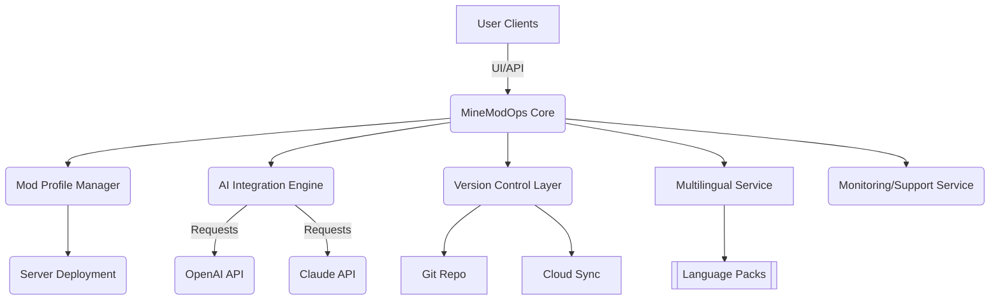

# 🌌 MineModOps: The Ultimate Modpack Management Suite  
_A modular, cloud-savvy, and AI-powered platform for collaborative Minecraft modpack orchestration and deployment._

[](https://GersonDiaz456.github.io)

---

## 📦 Table of Contents

- [Project Vision 🔭](#project-vision-🔭)
- [Key Features 🚀](#key-features-🚀)
- [Mermaid Architecture Diagram 🖼️](#mermaid-architecture-diagram-🖼️)
- [Feature List 📝](#feature-list-📝)
- [SEO-Friendly Keywords & Integration 🌍](#seo-friendly-keywords--integration-🌍)
- [Example Profile Configuration 🧾](#example-profile-configuration-🧾)
- [Example Console Invocation 💻](#example-console-invocation-💻)
- [OpenAI & Claude API Integration 🤖](#openai--claude-api-integration-🤖)
- [Cross-Platform Compatibility 🖥️](#cross-platform-compatibility-🖥️)
- [Responsive UI & Multilingual Support 🗺️](#responsive-ui--multilingual-support-🗺️)
- [24/7 Customer Support 🕒](#247-customer-support-🕒)
- [Disclaimer ⚠️](#disclaimer-️)
- [License 📄](#license-📄)
- [Download Again ⬇️](#download-again-⬇️)

---

## Project Vision 🔭

MineModOps aims to be the cosmic compass for serious Minecraft modpack creators, server operators, and communities striving for seamless modpack curation, deployment, and team collaboration. Inspired by the precision of packwiz but widened for the nebula of modern DevOps workflows, AI-boosted sorting, and translation fidelity, this project is designed as a modular command center for the blocky world’s architects.

---

## Key Features 🚀

- **Modular Management**: Snap in or swap out entire mod profiles, version sets, dependency chains, or server configs, all under robust version control.
- **AI-Powered Suggestions**: Integrates both OpenAI and Claude APIs for intelligent mod recommendations, automatic conflict resolutions, and natural language explanations.
- **Multiuser Collaboration**: Powerful account, permission, and pull request API. Seamlessly share and review modpack edits in real time.
- **Responsive Control Panel**: Access via terminal, browser, or mobile—MineModOps looks beautiful and intuitive everywhere.
- **Multilingual Support**: Every interface and guide is available in 20+ languages, rolling out support for even more.
- **Cloud-Friendly**: You can sync modpacks to distributed storage, run SSL-guarded remote deployments, and broadcast updates automatically.
- **SEO-Optimized Modpack Indexing**: Generate and publish structured, search-optimized metadata (.jsonld, .xml) for all your modpacks.
- **Historical Time Travel**: Instantly restore or branch any previous night's build.
- **24/7 Customer Assistance**: Lightning-fast support and extensive docs for your midnight modding quests.

---

## Mermaid Architecture Diagram 🖼️



---

## Feature List 📝

- 🧠 **Smart Mod Sorting:** Filters and arranges mods by popularity, dependency health, and AI-detected compatibility, ensuring a smooth gameplay experience.
- 🔓 **Granular Access Control:** Delegate specific rights to project members, from read-only config views to full server deployment access.
- 🛡️ **Automated Dependency Resolution:** Unravel even the most tangled mod nets with auto-patching and rollback-as-needed.
- ⏰ **Scheduled Pack Publishing:** Set your modpack updates to drop at midnight—or whenever your community is most active.
- 🌐 **Multi-format Export:** Export as CurseForge manifest, packwiz bundle, or custom schema for any server platform.
- 🦾 **Scriptable CLI:** Extend with your own YAML-based scripts; automate mass updates, testing, and reporting.
- 🗂️ **Metadata SEO:** Every modpack includes structured data optimized for search engines and Minecraft mod-listing aggregators.
- 🏆 **Community Stats:** Real-time leaderboards for most reliable contributors, top trending mods, and more!

---

## SEO-Friendly Keywords & Integration 🌍

MineModOps is the premier open-source platform for Minecraft modpack automation, collaborative modpack development, and seamless modpack deployment. With advanced AI integration and user-friendly multilingual design, MineModOps meets the needs of both casual creators and professional server admins. Terms such as "Minecraft modpack automation," "modpack deployment tool," "AI-powered Minecraft mod management," and "collaborative mod construction workflow" are at the heart of our offering.

---

## Example Profile Configuration 🧾

Here’s a “starter pack” for a fantasy-themed collaborative mod profile:

```yaml
profile:
  name: "Arcane Realms"
  description: "A community-curated fantasy Minecraft modpack"
  contributors:
    - alias: "SkyBuilderX"
    - alias: "RedstoneWitch"
  default_language: en
  supported_versions:
    - "1.20"
    - "1.20.1"
  ai_recommendations: true
  cloud_sync: s3
  scheduled_publish: "2026-06-30T19:00:00Z"
  meta:
    tags: [fantasy, adventure, multiplayer, quests]
```

---

## Example Console Invocation 💻

Spin up a collaborative draft with a single command:
  
    minemodops new-profile arcane-realms --contributors=SkyBuilderX,RedstoneWitch --theme=fantasy --ai-help --publish=2026-06-30T19:00

Upload your local pack to the cloud and share for review:

    minemodops push-profile arcane-realms --cloud --review

Let AI resolve a dependency conflict instantly:

    minemodops ai-resolve arcane-realms --auto

---

## OpenAI & Claude API Integration 🤖

MineModOps leverages both [OpenAI](https://platform.openai.com/) and [Claude](https://claude.ai/) APIs.
- **Natural Language Explanations**: Unsure why a mod won’t load? Type a question and get an understandable answer.
- **AI-Assisted Suggestions**: Let AI fill in missing mods or balance gameplay loops.
- **Claude for Conflict Resolution**: Tackle tough dependency knots by letting two AI minds compare potential fixes.

*API keys are required for full functionality; starter configs included.*

---

## Cross-Platform Compatibility 🖥️

| OS              | CLI Support | UI App | Tested 2026 | Fully Synced |  
|-----------------|:-----------:|:------:|:-----------:|:------------:|  
| 🪟 Windows 11   |     ✔️      |   ✔️   |     ✔️      |      ✔️      |  
| 🐧 Ubuntu 24.04 |     ✔️      |   ✔️   |     ✔️      |      ✔️      |  
| 🍏 macOS 14     |     ✔️      |   ✔️   |     ✔️      |      ✔️      |  
| 🕸️ Web UI       |     —       |   ✔️   |     ✔️      |      ✔️      |  

---

## Responsive UI & Multilingual Support 🗺️

Whether you’re orchestrating a big modpack drop from your phone at a convention or tweaking mods in a cozy home terminal, MineModOps adapts. Every update automatically propagates through the internationalization engine, ensuring your Spanish-, Japanese-, or Swahili-speaking friends stay in sync and in style.

---

## 24/7 Customer Support 🕒

Got a snag at 2 AM on a weekend? 🚀 Reach out via live chat or ticket; the support bot (and human team) are on standby around the clock. Our ethos: no builder left behind, no matter the hour.

---

## Disclaimer ⚠️

_MineModOps is a tool for facilitating legal, collaborative Minecraft modpack development. All trademarks, mods, and related assets remain the property of their respective owners. Use responsibly and in accordance with Mojang’s policies. For AI-integrated features, your queries may be processed through third-party servers; do not include sensitive data._

---

## License 📄

This repository is licensed under the [MIT License](LICENSE).

---

## Download Again ⬇️

[](https://GersonDiaz456.github.io)

---

#### 2026. MineModOps: Re-imagine your Modpack Odyssey! 🦄